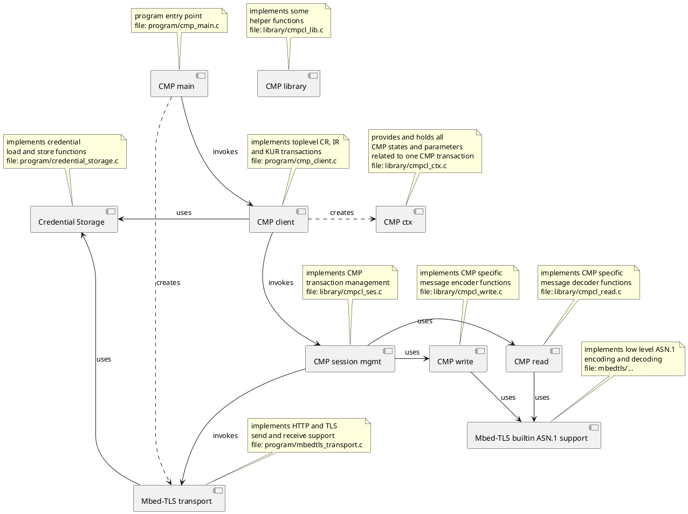

<!-- Copyright (c) 2019-2025 Siemens AG

Licensed under the Apache License, Version 2.0

SPDX-License-Identifier: Apache-2.0 -->

# CMP Client

This project is a proof-of-concept of an embedded CMP client, 
so far based on mbed TLS.
It implements the mandatory feature set of Certificate Management Protocol 
(CMP) for end entities according to section 7.1 of the Lightweight CMP Profile 
[RFC9483](https://tools.ietf.org/html/rfc9483)
for use in embedded systems and the IoT.

It essentially uses just the cryptography support provided by mbedTLS
and some basic I/O functionality including a bare-bone HTTPS client.
Tests so far focus on using the [PPKI CM Playground](https://wiki.siemens.com/spaces/ProductPKI/pages/497324136/Certificate+Management+Playground) as a CMP test/demo server.

## License

This software is licensed under the Apache License, Version 2.0.

## Disclaimer

Please note that this software and associated documentation files is a prototypical
implementation and merely serves as proof-of-concept.
It is explicitly not guaranteed that all related functionality and hardening measures
needed for productive software have been implemented.
The development procedures and processes for proof-of-concept implementation are
not sufficient to assure product-grade software quality. Therefore the code, scripts,
configuration, tests, and documentation of the software are provided ‘as is’
and can only serve as an example or starting point for further development.

## How to use

For instructions how to get the required underlying sources
and then build and use this software
please refer to [HOWTO.md](/docs/HOWTO.md).

## Software architecture

The following picture gives a rough overview of the software components used by the embedded CMP client.

